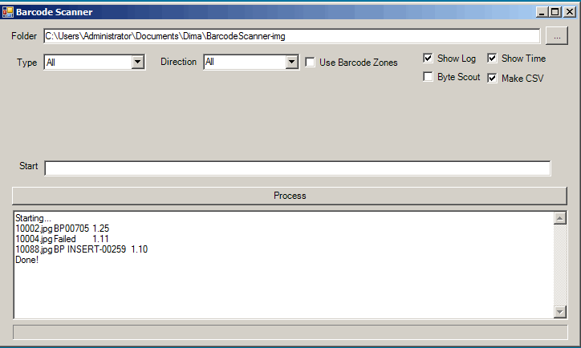

# Barcode Scanner

Originally posted here: 
https://www.codeproject.com/Articles/1274528/Barcode-Scanner

This Windows application lets you scan image in a given folder and generate CSV file to show barcodes for each image file.

## Introduction
This Windows application lets you scan image in a given folder (and subfolders) and generate CSV file based on the output. This article uses the BarcodeImaging.dll library developed by Berend Engelbrecht to scan barcodes: Reading Barcodes from an Image - III.

## Background
I found that BarcodeImaging.dll library does a pretty decent job, but for some cases I needed to use Byte Scout (Bytescout.BarCodeReader.dll) library (which costs $20 and is slow). I tried Byte Scout library for comparison but left it unchecked in the application, in case someone will still want to try it.

## Using the Code
To use this program, simply select a folder and click Process. The program will create a CSV file within target folder.
